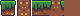
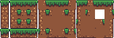

# autotyler

Autotyler is a program that turns small "incomplete" tilemaps into complete godot 3x3 minimal autotile tilemaps, including support for configuring edge sizes.

Licensed under the Apache license, version 2.0.

In: 

Out: 

## Why?

Existing tools for this generally don't allow you to specify how much of the tile is taken up by edges. This means that they would chop off parts of edges when copying them onto other tiles. For example, [Godot Autotiles Assembler](https://github.com/lunarfyre7/GodotAutotileAssembler) assembles this input:



something like this:


while autotyler can assemble it like this, using `edges=8,12,8,4`:



(Example adapted from [this entry on opengameart](https://opengameart.org/content/2d-nature-platformer-tileset-16x16))

Also, autotyler supports more commonly-shaped input formats (3x3 and 4x4), and also a pathetically small input format (literally just two tiles).

There are five other algorithms with varying levels of sophistication, as below:

### basic_border


### 3x3


or with edges=8,6,8,10:


### 4x4


### minitiles


The minitiles algorithm has the same input as https://github.com/lunarfyre7/GodotAutotileAssembler

## Usage
```
autotyler <infile> <outfile> <options> [tile list]

options:
  mode=basic | basic_border | 3x3 | 4x4 | minitiles
    The algorithm used to generate the tilemap.
      basic: 2 tiles, see examples. (default)
      basic_border: 2 tiles, see examples.
      3x3: 9 tiles, see examples.
      4x4: 16 tiles, see examples.
      minitiles: 5 tiles, see https://github.com/lunarfyre7/GodotAutotileAssembler and examples.
  size=N
    The height and width of the tile in pixels. Currently only support square tiles.
  edges=LEFT,TOP,RIGHT,BOTTOM | LEFT,TOP | LEFT
    The amount of space taken up by edges. Omitted dimensions are generated by subtracting the opposite dimension from the tile size, or by copying the adjacent edge. Only minitiles is guaranteed to work with edges settings where opposite edges don't add up to the tilesize.
  offset=N
    The offset, in TILES (not pixels), from the top left corner of the screen from which to search for tiles. Useful for using the same input tilesheet to generate many tilemaps.
  border=N
    Used exclusively by the basic_border algorithm. The default is 2.

Do not place spaces around the = when specifying options.

tile list:
  The basic, basic_border, and minitiles modes allow you to list arbitrary tile coordinates to grab tiles from. Support for this will be added to the 3x3 and 4x4 modes later on.
  Example:
    autotyler basic.png out.png size=32 offset=4,1 0,0 0,2
This gets the first tile from 4,1 and the second tile from 4,3.

The tile list is optional.
```

## Output

The output is a tilemap set up for godot 3x3 minimal autotiling with this bitmask:


## Modes

The five algorithms take these kinds of inputs, in terms of autotile bitmasks:

### basic


### basic_border


### 3x3


### 4x4


### minitiles


